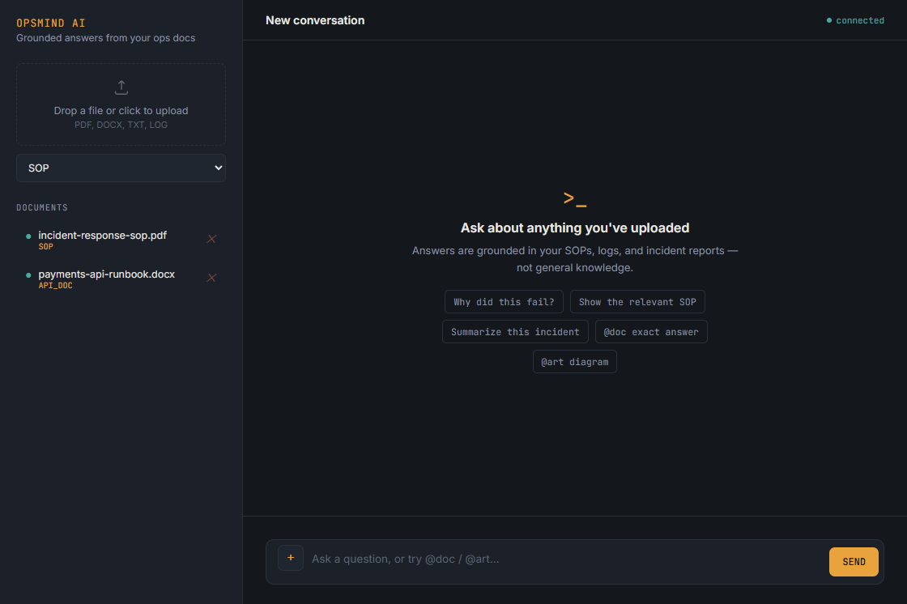

<div align="center">
  <h1>OpsMind AI</h1>
  <p><strong>Operational answers, grounded in your own documents.</strong></p>
  <p>Search SOPs, incident reports, runbooks, and diagrams with a document-aware AI copilot.</p>
  <p>
    <a href="#quick-start">Quick start</a> ·
    <a href="#features">Features</a> ·
    <a href="#architecture">Architecture</a> ·
    <a href="#endpoints">API</a>
  </p>
  <p>
    
    
    
    
    
  </p>
</div>

<p align="center">
  
</p>
<p align="center"><sub>Desktop UI preview. The listed filenames are fictional demo data.</sub></p>

---

OpsMind is a document-grounded copilot for support and operations teams. Answers are retrieved from uploaded files, not generated from model knowledge alone. It supports exact source excerpts, grounded diagrams, multimodal PDF retrieval, and bounded diagnostic investigations.

## Features

<table>
  <tr>
    <td width="33%"><strong>Grounded answers</strong><br>Retrieve relevant passages with source files and page references. A confidence gate avoids answering from weak matches.</td>
    <td width="33%"><strong>Verbatim mode</strong><br><code>@doc</code> selects and returns an answer from the source document without rewriting it.</td>
    <td width="33%"><strong>Document diagrams</strong><br><code>@art</code> creates an interactive, exportable diagram based on retrieved content.</td>
  </tr>
  <tr>
    <td><strong>Text + image retrieval</strong><br>PDF text and embedded figures share a multimodal embedding space.</td>
    <td><strong>Bounded investigations</strong><br>A LangGraph agent can clarify a request or follow a limited diagnostic loop.</td>
    <td><strong>Resilient model calls</strong><br>Gemini requests use model fallbacks for quota limits and unavailable models.</td>
  </tr>
</table>

## Stack

FastAPI · PostgreSQL + pgvector · Gemini API (`gemini-embedding-2` for
multimodal embeddings, a fallback chain of chat models for generation) ·
LangGraph · Docker · vanilla HTML/CSS/JS frontend (no framework, no build
step, served directly by FastAPI)

## Quick start

1. Get a Gemini API key from [Google AI Studio](https://aistudio.google.com/).
2. Copy `.env.example` to `.env`:

    ```powershell
    Copy-Item .env.example .env
    ```

  On macOS or Linux, use `cp .env.example .env`.
3. Replace the placeholder `GEMINI_API_KEY` value in `.env` with your key.
4. Build and start the app:

    ```sh
    docker compose up --build
    ```

5. Open [http://localhost:8000](http://localhost:8000). Interactive API docs are at [http://localhost:8000/docs](http://localhost:8000/docs).

### Tests and CI

With Compose running, execute the test suite from a second terminal:

```sh
docker compose exec -T api python -m pytest -q tests/
```

GitHub Actions runs this suite on pushes and pull requests. It uses real pgvector retrieval while stubbing Gemini calls, so CI needs no Gemini secret and consumes no API quota.

<details>
<summary><strong>Architecture details</strong></summary>

## Architecture

**Ingestion:** file → extract per-page/section (`pypdf` for text-layer PDFs,
`PyMuPDF` + Gemini vision OCR for scanned PDFs, `python-docx` for `.docx`
with manual line-break preservation so ASCII diagrams in source documents
survive extraction intact, plain text for logs/SOPs) → paragraph-aware
chunking → each chunk embedded with `gemini-embedding-2` (Google's
multimodal embedding model — text and images share one 768-dim vector
space) → stored in `chunks`, tagged with page number and modality
(`text`/`image`). PDFs also have their embedded images extracted directly
(not just OCR'd), captioned, and embedded the same way — capped and
size-filtered to protect free-tier quota.

**Normal chat (`/chat`, `/chat/stream`):** question → optionally scoped to
attached document(s) → embed → cosine-similarity search → confidence gate
(refuses to guess on weak retrieval) → top matches (text *and* image
chunks) sent to Gemini, with retrieved images passed as actual image
content, not just captions → answer streamed via SSE, sources shown with
page numbers and image thumbnails.

**`@doc` exact-answer mode:** retrieves a *wide* candidate pool (not just
the top match — a loosely-phrased question like "brief me about the whole
project" often isn't closest-by-raw-cosine to the one section that actually
answers it best), then one lightweight LLM call *selects* which candidate
genuinely answers the question — it never generates the answer text itself.
The selected section is reconstructed from real stored chunk text and
trimmed to its actual heading-delimited boundaries (not a fixed-size
window, which either truncates long answers or bleeds into the next
section), so the response is guaranteed verbatim, starting at the real
content — never the section heading, never a duplicate source snippet.

**`@art` diagram mode:** retrieves context, then asks Gemini for Mermaid
diagram syntax under explicit layout constraints (bounded siblings per
rank, subgraph grouping, a node-count budget) — the fix for diagrams that
otherwise sprawl horizontally is at the *generation* prompt, not just
rendering. Rendered client-side as real SVG with adaptive sizing (scales
small diagrams up for readability, never blows up an already-large one
further), plus "open full size" and a real PNG export (canvas-based, since
browsers don't offer "save as image" for inline SVGs).

**Agentic layer (`/chat/agent`, LangGraph):** a triage call classifies each
question as `direct`, `clarify`, or `investigate`. Direct questions retrieve
and answer like normal chat. Ambiguous questions get a clarifying question
with zero retrieval spent. Diagnostic questions enter a bounded loop (max 3
iterations, enforced in code, not just prompted for): each iteration picks
one relevant diagnostic check from retrieved content, evaluates it, and
records the result so later iterations don't re-derive the same partial
conclusion — ending in a resolved answer, a request for specific missing
evidence, or an escalation summarizing what was actually checked.

**Model resilience:** every Gemini call (generation, streaming, structured
JSON, OCR, image captioning) routes through a fallback chain ordered by
real, verified daily quota headroom — confirmed directly against the
AI Studio dashboard rather than trusted from inconsistent blog posts. On a
429 (quota) or 404 (deprecated/unavailable), the next model is tried
automatically; transient 5xx errors retry the *same* model first.

</details>

## Endpoints

| Endpoint | Method | What it does |
|---|---|---|
| `/` | GET | Serves the chat UI |
| `/documents/upload` | POST | Upload a file — extracts (with OCR/DOCX support), chunks per page/section, embeds text *and* images, stores |
| `/documents` | GET | List uploaded documents |
| `/documents/{id}` | DELETE | Delete a document and its chunks (cascades) |
| `/chat` | POST | `{"question", "conversation_id"?, "document_ids"?}` — normal chat, `@doc`, and `@art` modes all route through here |
| `/chat/stream` | POST | Same, streamed via Server-Sent Events |
| `/chat/agent` | POST | Runs the LangGraph agent instead of the linear pipeline; response includes `intent` and `investigation_steps` |
| `/health` | GET | Liveness check |

<details>
<summary><strong>Data model and project layout</strong></summary>

## Database schema

- `documents` — filename, doc_type, uploaded_at
- `chunks` — content (text, or an image's caption) + `vector(768)` embedding
  + `metadata` (page number) + `modality` (`text`/`image`) + `image_data`
  (raw bytes, for image chunks) + reference to source document (cascades on delete)
- `conversations` / `messages` — session and turn-by-turn history

Schema lives in `db/init.sql` (fresh installs); `db/migrations/` holds
migrations for databases created before a given feature (e.g. multimodal
columns) existed.

## Project structure

```
opsmind-ai/
├── .env.example
├── .github/workflows/ci.yml
├── app/
│   ├── main.py           # HTTP layer: chat/doc/art/agent endpoints, upload, extraction
│   ├── agent.py           # LangGraph agentic layer: state, nodes, routing
│   ├── retrieval.py        # shared retrieval helpers (used by main.py AND agent.py)
│   ├── gemini_client.py    # all Gemini calls: embeddings, generation, streaming,
│   │                       #   structured output, diagrams, OCR, the fallback chain
│   ├── chunking.py         # paragraph-aware chunking
│   ├── db.py               # connection handling, pgvector registration
│   └── static/index.html   # single-file frontend
├── tests/
│   ├── conftest.py         # test-only environment defaults
│   ├── test_agent.py       # offline investigation step-cap test
│   └── test_api.py         # API-to-Postgres chat integration test
├── db/
│   ├── init.sql            # schema for fresh installs
│   └── migrations/         # migrations for existing databases
├── docker-compose.yml
├── Dockerfile
├── requirements.txt
└── docs/images/opsmind-desktop.png
```

`app/retrieval.py` exists specifically so `agent.py` doesn't import from
`main.py` (which would create a circular import once `main.py` imports the
agent back) — retrieval logic exists in exactly one place either way.

</details>

## What's deliberately left for a next phase

- **Wiring `/chat/agent` into the frontend** — currently Swagger-only
- **Hybrid search (vector + full-text)** — ops data has exact identifiers
  (case IDs, error codes) that pure vector similarity handles poorly;
  Postgres supports `tsvector` natively alongside `pgvector`
- **RAG evaluation dashboard** — a golden Q&A set with tracked
  retrieval/answer-quality metrics
- **Auth, structured logging**

<details>
<summary><strong>Engineering notes and lessons learned</strong></summary>

## Lessons learned / troubleshooting notes

Real issues hit and fixed during this build — kept here because several of
these are more interesting to discuss than the features themselves:

**Database / retrieval**
- `pgvector`'s `<=>` operator needs an explicit `%s::vector` cast in the
  query — `psycopg2`'s `register_vector` handles inserts fine via an
  assignment cast, but similarity search only resolves implicit casts.
- Global retrieval across all documents causes cross-document confusion
  once more than one is uploaded — fixed with optional `document_ids`
  scoping.
- A confident-sounding answer from weak retrieval is worse than no answer —
  the confidence gate refuses to generate when the top match is too
  dissimilar.
- A loosely-phrased question isn't necessarily closest-by-cosine to the
  section that best answers it (`@doc`'s original bug) — fixed with a wide
  candidate pool plus one LLM *selection* call, not more embedding tuning.
- A fixed-size context window either truncates long answers or bleeds into
  neighboring sections — fixed with heading-boundary detection instead of
  window-size guessing.

**Gemini API / model config**
- `gemini-embedding-001` is text-only; true multimodal retrieval needs
  `gemini-embedding-2`, which embeds text and images into one shared space.
- Don't pin the client to `api_version: "v1"` — the older REST surface
  doesn't recognize `systemInstruction`; this regressed more than once
  after being "fixed" in conversation but not actually saved to disk.
- Hard-coded dated model strings get cut off without much warning
  (`gemini-2.5-flash` was pulled from new-user access ahead of its
  published deprecation date) — an alias helps but isn't a complete fix,
  since aliases can silently point to a model with a much stricter quota.
- Free-tier daily quotas are per (project, model) and can be surprisingly
  low (as low as 20/day for some models) — verified directly on the AI
  Studio dashboard, not trusted from inconsistent third-party numbers. The
  real fix was a model fallback chain, not picking one "better" model.
- `generate_content` and `embed_content` draw from separate quota pools.
- LangGraph node names can't collide with state field names — naming a
  node `"answer"` when the state also has an `answer` field raised
  `ValueError: 'answer' is already being used as a state key` at import
  time.

**Frontend**
- `GET` requests can be silently browser-cached even with no explicit
  cache headers — fixed with `cache: 'no-store'` plus a matching response
  header.
- Right-clicking an inline `<svg>` never offers "save as image" — only a
  canvas-based PNG export actually gives the user a real downloadable file.
- A flat size multiplier on generated diagrams magnifies bad layout instead
  of fixing it — the real fix is layout constraints in the *generation*
  prompt; rendering only needed adaptive (not flat) sizing on top of that.
- Styling part of a plain `<textarea>`'s text (e.g. coloring just `@doc`
  blue) isn't possible natively — needs a transparent-text textarea
  stacked over a mirrored, styled backdrop `div`, kept in sync on every
  keystroke.

**Agent design**
- A numeric confidence score with no evaluation data to calibrate it
  against is fake precision — `evidence_status` is a categorical label
  (`sufficient`/`insufficient`/`conflicting`), not a float.
- A bounded loop needs real memory (`investigation_steps`), or it can waste
  its step budget re-deriving the same partial conclusion twice.
- Never trust a model to self-limit a loop it's inside of — the step cap
  is enforced in code and proven with an offline test that mocks the model
  to always ask for one more iteration and confirms the cap still holds.
- The investigate loop's diagnostic checks come from whatever's actually
  retrieved, not hardcoded graph nodes — otherwise it's a single
  domain-specific workflow wearing an "agent" label, not something that
  generalizes.

</details>
